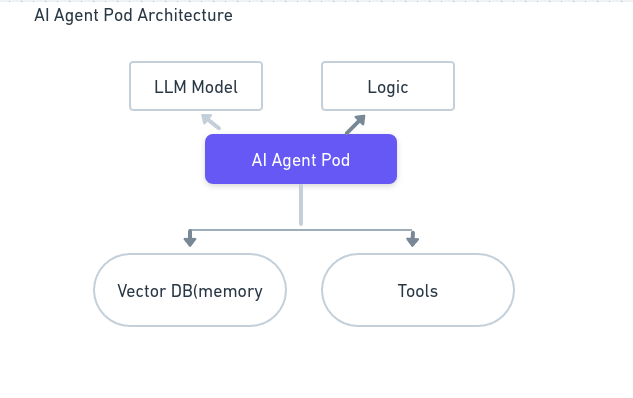
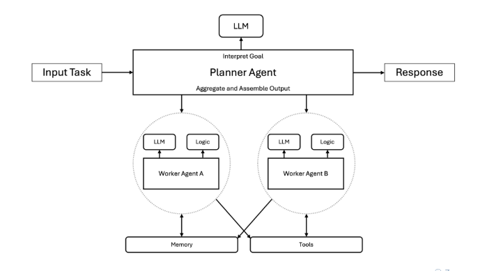

Difference between AI and Agentic AI

AI Agent:
- inidivual autonomous entity that performs specific tasks thorogh tool integration and prompt engineering
- it is like a single purpose microservice that can do only 1 task
- eg like customer queries and reset password kind of task a agent can do

AI Agent Architecture

- it includes a model and some runtime logic     
- it also integrate with memeory or tools to extend its capabilites
- it needs memory to store context betwen requests.

Agentic AI:

- A agentic AI is a complex system where the AI Agents are orchestrated together to breakdown a complex problem into subtasks and coordianted between the agents

consider a ecommerece website where the pricing agent, inventory agent and support agents works together by interatcing with each other. Each agent can operate independently biui collaborate towars common goal

- agent can self correct and refine their approach over multiple steps

- agents communicate though shared memoty 

Agentic AI Architecture:

